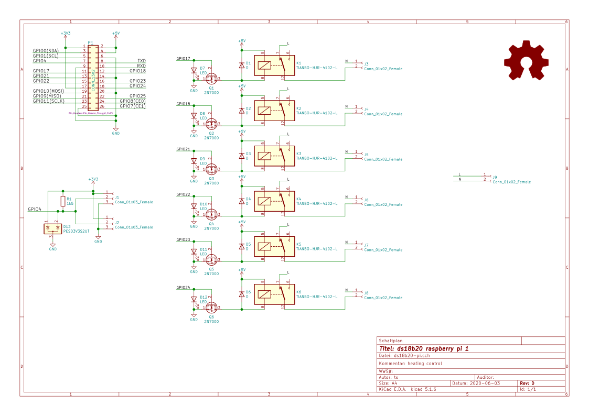

# ds18b20-pi

A simple extension board for the raspberry pi 1 model **b** with only **26** GPIO pins.
It's purpose is to make GPIO**4** easily accessible, because it's used for the [1-Wire](https://en.wikipedia.org/wiki/1-Wire) bus.
By easily I mean by using [screw terminal](https://www.reichelt.de/leiterplattenklemme-3-polig-rm-3-5-mm-dg350-3-5-3-p276225.html?&nbc=1)s.
As the [1-Wire](https://en.wikipedia.org/wiki/1-Wire) bus is a **bus**, it makes no sense to create several junctions on the pcb.
Just turn the cable into a [cable harness](https://en.wikipedia.org/wiki/Cable_harness).

That "trick" created space which is now used to switch a floor heating's automatic control electric motor.
Those motors are pretty dumb.
If powered the motor opens the valve, if not it closes the valve.
So there is no communication protocol, just a simple "on/off switch" that can be implemented by a GPIO pin, a relay, a [free-wheeling diode](https://en.wikipedia.org/wiki/Flyback_diode) and a [mosfet](https://en.wikipedia.org/wiki/MOSFET) because the relay needs 5V.
Normally I would add a pull-down resistor (10k) to every mosfet's gate, but there is not enough space.
If things get messy it should be possible to place tht resistors at the bottom side or maybe even just smd resistors between every mosfet's source (square) and gate (middle) pin.

## bom

| part | description | price |
|------|-------------|-------|
| [2N 7000 DIO](https://www.reichelt.de/mosfet-n-ch-60v-0-115a-0-4w-to-92-2n-7000-dio-p219075.html) | n-channel mosfet | 0,08 € |
| [BAT 48 STM](https://www.reichelt.de/schottkydiode-40-v-0-35-a-do-35-bat-48-stm-p219563.html) | schottky diode | 0,04 € |
| [DG350 3,5-2](https://www.reichelt.de/leiterplattenklemme-2-polig-rm-3-5-mm-dg350-3-5-2-p276224.html) | connector 2-pins | 0,19 € |
| [DG350 3,5-3](https://www.reichelt.de/leiterplattenklemme-3-polig-rm-3-5-mm-dg350-3-5-3-p276225.html) | connector 3-pins | 0,28 € |

## schematic

[](.images/ds18b20-pi.svg)

## board

[](.images/ds18b20-pi-brd.svg)

## rendering 


Raspberry Pi 1 GPIO extension board for the 1-wire bus

## note

* `pcb_new`: `File -> Export -> SVG`, *all layers in a single file*, *print board edges*, *color*
* `eeschema`: `File -> Plot`, *SVG*, *Page Size: A4*, *Output mode: color*, *Plot border and title block*

```
$ convert -background white schematic_export.svg schematic_export.png
$ convert -background none board_export.svg board_export.png
```

`convert` is part of [ImageMagick](https://imagemagick.org/index.php).
